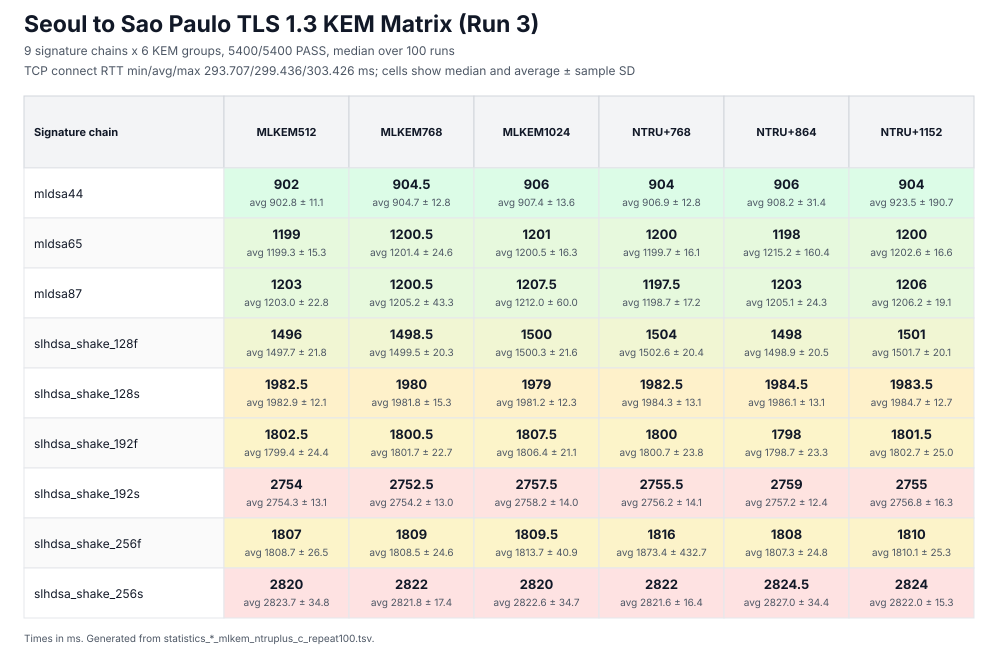

# Seoul to Sao Paulo TLS Bench (Run 3)

TLS 1.3 handshake measurements from a Seoul client to a Sao Paulo server, restricted to standalone ML-KEM and NTRU+ key-exchange groups.



## Summary

- Route: Seoul -> Sao Paulo
- Target: `18.230.56.229:4443`
- Implementation: C implementation (`--code-path c`)
- Signature chains: 9
- KEM groups per chain: 6
- Runs per combination: 100
- Total combinations: 54
- Total handshakes: 5400
- Passed: 5400
- Failed: 0
- Overall average: 1778.0 ms
- Fastest median: `mldsa44 / MLKEM512` = 902 ms
- Slowest median: `slhdsa_shake_256s / NTRU+864` = 2824.5 ms
- Raw results: `result_*_mlkem_ntruplus_c_repeat100.tsv`
- Benchmark summaries: `summary_*_mlkem_ntruplus_c_repeat100.tsv`
- Extended statistics: `statistics_*_mlkem_ntruplus_c_repeat100.tsv`

## Network Baseline

TCP connection RTT was measured after the benchmark using Nping's unprivileged TCP connect mode.

```sh
nping --tcp-connect -p 4443 -c 5 18.230.56.229
```

- Tool: Nping 0.7.94SVN
- Time: 2026-09-02 02:44 KST
- RTT: min 293.707 ms, avg 299.436 ms, max 303.426 ms
- Connections: 5/5 successful; failure rate 0.00%

## Median Matrix

Values are median end-to-end TLS handshake times in milliseconds over 100 runs.

| Signature chain | `MLKEM512` | `MLKEM768` | `MLKEM1024` | `NTRU+768` | `NTRU+864` | `NTRU+1152` |
| --- | ---: | ---: | ---: | ---: | ---: | ---: |
| `mldsa44` | 902 | 904.5 | 906 | 904 | 906 | 904 |
| `mldsa65` | 1199 | 1200.5 | 1201 | 1200 | 1198 | 1200 |
| `mldsa87` | 1203 | 1200.5 | 1207.5 | 1197.5 | 1203 | 1206 |
| `slhdsa_shake_128f` | 1496 | 1498.5 | 1500 | 1504 | 1498 | 1501 |
| `slhdsa_shake_128s` | 1982.5 | 1980 | 1979 | 1982.5 | 1984.5 | 1983.5 |
| `slhdsa_shake_192f` | 1802.5 | 1800.5 | 1807.5 | 1800 | 1798 | 1801.5 |
| `slhdsa_shake_192s` | 2754 | 2752.5 | 2757.5 | 2755.5 | 2759 | 2755 |
| `slhdsa_shake_256f` | 1807 | 1809 | 1809.5 | 1816 | 1808 | 1810 |
| `slhdsa_shake_256s` | 2820 | 2822 | 2820 | 2822 | 2824.5 | 2824 |

## Detailed Statistics

### `mldsa44`

| 그룹 | PASS | 평균 | 중앙값 | 표준편차 | 최소–최대 |
| --- | ---: | ---: | ---: | ---: | ---: |
| MLKEM512 | 100/100 | 902.8 ms | 902 ms | 11.1 ms | 881–929 ms |
| MLKEM768 | 100/100 | 904.7 ms | 904.5 ms | 12.8 ms | 879–932 ms |
| MLKEM1024 | 100/100 | 907.4 ms | 906 ms | 13.6 ms | 877–954 ms |
| NTRU+768 | 100/100 | 906.9 ms | 904 ms | 12.8 ms | 881–966 ms |
| NTRU+864 | 100/100 | 908.2 ms | 906 ms | 31.4 ms | 882–1194 ms |
| NTRU+1152 | 100/100 | 923.5 ms | 904 ms | 190.7 ms | 882–2808 ms |

### `mldsa65`

| 그룹 | PASS | 평균 | 중앙값 | 표준편차 | 최소–최대 |
| --- | ---: | ---: | ---: | ---: | ---: |
| MLKEM512 | 100/100 | 1199.3 ms | 1199 ms | 15.3 ms | 1170–1230 ms |
| MLKEM768 | 100/100 | 1201.4 ms | 1200.5 ms | 24.6 ms | 1167–1389 ms |
| MLKEM1024 | 100/100 | 1200.5 ms | 1201 ms | 16.3 ms | 1168–1239 ms |
| NTRU+768 | 100/100 | 1199.7 ms | 1200 ms | 16.1 ms | 1169–1235 ms |
| NTRU+864 | 100/100 | 1215.2 ms | 1198 ms | 160.4 ms | 1166–2795 ms |
| NTRU+1152 | 100/100 | 1202.6 ms | 1200 ms | 16.6 ms | 1166–1243 ms |

### `mldsa87`

| 그룹 | PASS | 평균 | 중앙값 | 표준편차 | 최소–최대 |
| --- | ---: | ---: | ---: | ---: | ---: |
| MLKEM512 | 100/100 | 1203.0 ms | 1203 ms | 22.8 ms | 1167–1322 ms |
| MLKEM768 | 100/100 | 1205.2 ms | 1200.5 ms | 43.3 ms | 1171–1606 ms |
| MLKEM1024 | 100/100 | 1212.0 ms | 1207.5 ms | 60.0 ms | 1168–1778 ms |
| NTRU+768 | 100/100 | 1198.7 ms | 1197.5 ms | 17.2 ms | 1169–1233 ms |
| NTRU+864 | 100/100 | 1205.1 ms | 1203 ms | 24.3 ms | 1169–1391 ms |
| NTRU+1152 | 100/100 | 1206.2 ms | 1206 ms | 19.1 ms | 1171–1306 ms |

### `slhdsa_shake_128f`

| 그룹 | PASS | 평균 | 중앙값 | 표준편차 | 최소–최대 |
| --- | ---: | ---: | ---: | ---: | ---: |
| MLKEM512 | 100/100 | 1497.7 ms | 1496 ms | 21.8 ms | 1456–1543 ms |
| MLKEM768 | 100/100 | 1499.5 ms | 1498.5 ms | 20.3 ms | 1459–1543 ms |
| MLKEM1024 | 100/100 | 1500.3 ms | 1500 ms | 21.6 ms | 1457–1540 ms |
| NTRU+768 | 100/100 | 1502.6 ms | 1504 ms | 20.4 ms | 1461–1543 ms |
| NTRU+864 | 100/100 | 1498.9 ms | 1498 ms | 20.5 ms | 1459–1538 ms |
| NTRU+1152 | 100/100 | 1501.7 ms | 1501 ms | 20.1 ms | 1458–1548 ms |

### `slhdsa_shake_128s`

| 그룹 | PASS | 평균 | 중앙값 | 표준편차 | 최소–최대 |
| --- | ---: | ---: | ---: | ---: | ---: |
| MLKEM512 | 100/100 | 1982.9 ms | 1982.5 ms | 12.1 ms | 1956–2014 ms |
| MLKEM768 | 100/100 | 1981.8 ms | 1980 ms | 15.3 ms | 1957–2053 ms |
| MLKEM1024 | 100/100 | 1981.2 ms | 1979 ms | 12.3 ms | 1956–2030 ms |
| NTRU+768 | 100/100 | 1984.3 ms | 1982.5 ms | 13.1 ms | 1954–2013 ms |
| NTRU+864 | 100/100 | 1986.1 ms | 1984.5 ms | 13.1 ms | 1960–2027 ms |
| NTRU+1152 | 100/100 | 1984.7 ms | 1983.5 ms | 12.7 ms | 1958–2020 ms |

### `slhdsa_shake_192f`

| 그룹 | PASS | 평균 | 중앙값 | 표준편차 | 최소–최대 |
| --- | ---: | ---: | ---: | ---: | ---: |
| MLKEM512 | 100/100 | 1799.4 ms | 1802.5 ms | 24.4 ms | 1751–1844 ms |
| MLKEM768 | 100/100 | 1801.7 ms | 1800.5 ms | 22.7 ms | 1750–1864 ms |
| MLKEM1024 | 100/100 | 1806.4 ms | 1807.5 ms | 21.1 ms | 1762–1845 ms |
| NTRU+768 | 100/100 | 1800.7 ms | 1800 ms | 23.8 ms | 1751–1865 ms |
| NTRU+864 | 100/100 | 1798.7 ms | 1798 ms | 23.3 ms | 1752–1844 ms |
| NTRU+1152 | 100/100 | 1802.7 ms | 1801.5 ms | 25.0 ms | 1751–1883 ms |

### `slhdsa_shake_192s`

| 그룹 | PASS | 평균 | 중앙값 | 표준편차 | 최소–최대 |
| --- | ---: | ---: | ---: | ---: | ---: |
| MLKEM512 | 100/100 | 2754.3 ms | 2754 ms | 13.1 ms | 2730–2793 ms |
| MLKEM768 | 100/100 | 2754.2 ms | 2752.5 ms | 13.0 ms | 2730–2798 ms |
| MLKEM1024 | 100/100 | 2758.2 ms | 2757.5 ms | 14.0 ms | 2733–2801 ms |
| NTRU+768 | 100/100 | 2756.2 ms | 2755.5 ms | 14.1 ms | 2727–2795 ms |
| NTRU+864 | 100/100 | 2757.2 ms | 2759 ms | 12.4 ms | 2727–2799 ms |
| NTRU+1152 | 100/100 | 2756.8 ms | 2755 ms | 16.3 ms | 2727–2839 ms |

### `slhdsa_shake_256f`

| 그룹 | PASS | 평균 | 중앙값 | 표준편차 | 최소–최대 |
| --- | ---: | ---: | ---: | ---: | ---: |
| MLKEM512 | 100/100 | 1808.7 ms | 1807 ms | 26.5 ms | 1756–1914 ms |
| MLKEM768 | 100/100 | 1808.5 ms | 1809 ms | 24.6 ms | 1760–1853 ms |
| MLKEM1024 | 100/100 | 1813.7 ms | 1809.5 ms | 40.9 ms | 1757–2132 ms |
| NTRU+768 | 100/100 | 1873.4 ms | 1816 ms | 432.7 ms | 1758–6074 ms |
| NTRU+864 | 100/100 | 1807.3 ms | 1808 ms | 24.8 ms | 1759–1858 ms |
| NTRU+1152 | 100/100 | 1810.1 ms | 1810 ms | 25.3 ms | 1758–1904 ms |

### `slhdsa_shake_256s`

| 그룹 | PASS | 평균 | 중앙값 | 표준편차 | 최소–최대 |
| --- | ---: | ---: | ---: | ---: | ---: |
| MLKEM512 | 100/100 | 2823.7 ms | 2820 ms | 34.8 ms | 2784–3127 ms |
| MLKEM768 | 100/100 | 2821.8 ms | 2822 ms | 17.4 ms | 2784–2877 ms |
| MLKEM1024 | 100/100 | 2822.6 ms | 2820 ms | 34.7 ms | 2784–3127 ms |
| NTRU+768 | 100/100 | 2821.6 ms | 2822 ms | 16.4 ms | 2779–2864 ms |
| NTRU+864 | 100/100 | 2827.0 ms | 2824.5 ms | 34.4 ms | 2788–3117 ms |
| NTRU+1152 | 100/100 | 2822.0 ms | 2824 ms | 15.3 ms | 2791–2860 ms |

## Notes

- All included combinations passed.
- Client logs were checked for TLS 1.3, certificate verification, expected signature type, and negotiated KEM group.
- Standard deviation is the sample standard deviation of successful handshake times.
- Means and standard deviations are sensitive to isolated network or scheduling delays; medians are more robust for comparing typical runs.
- Only complete six-group datasets are included.
